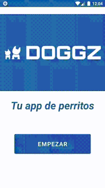
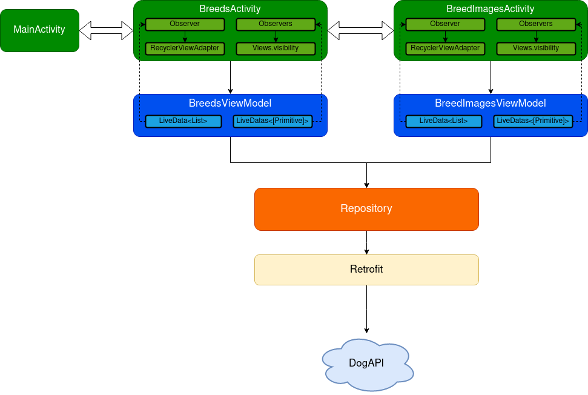

# DOGGZ
App de Android realizada en Kotlin utilizando arquitectura MVVM. La app se conecta a la API de https://dog.ceo/dog-api/ y obtiene el listado de razas de perros disponibles, además de un listado de imágenes de cada raza al seleccionar alguna.

## Funcionalidades
 - [x] Mostrar listado de razas de perros
 - [x] Mostrar imágenes de una raza seleccionada
 - [x] Filtro en tiempo real del listado de razas
 - [x] Control de error por problema de respuesta de API/conexión a Internet
 - [x] Modificación de UI dinámica

## Demo

## Arquitectura

## Librerías
 - **Material:** Cardview y estilo de botón
 - **Retrofit:** Consumo de API
 - **ViewModel & LiveData:** Arquitectura
 - **Coroutinas:** Operaciones asíncronas
 - **Picasso:** Imágenes desde URL
 - **Koin:** Inyección de dependencias
 - **JUnit:** tests unitarios

## Tests
Se incorporaron pruebas unitarias en la app utilizando JUnit, enfocadas en la lógica de la capa ViewModel. Se realizó mock del repositorio para poder simular las consultas a la API.

